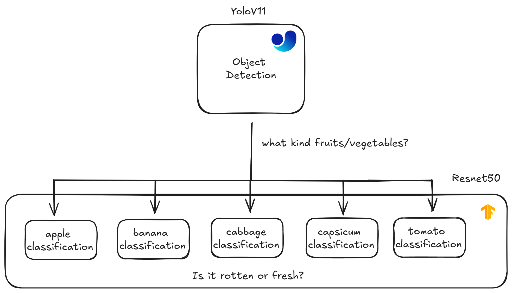

# Quality assesment with [ResidualNet50](https://arxiv.org/abs/1512.03385)

The ML model we created here utilizes ResNet as the main architecture for classifying whether a fruit is rotten or fresh with a percentage of confidence. This model is separated into two models: one for classification and another for object detection. The entire model supports only five categories of fruits and vegetables, as you can see below.

## Why ResNet?

The Reason is simple, because ResNet has skipping connection so it make the model it self can go deeper without worrying performance degredation unlike other architecture (VGG, Alex, etc). So it make this architecture easier to train and this skipping connection implicitly make this model better at regularization. 

## Preparing the data
As for the data we use : 
- https://www.kaggle.com/datasets/swoyam2609/fresh-and-stale-classification
- https://data.mendeley.com/datasets/fy3xg64s3z/1

Also we use data generated from FLUX AI to help add new variation of the data to our model. The distribution it self like 40% data is generated from AI and for 60% data is real data (like we mention above). 

Also we implemented data augmentation like 
- Random Brighness
- Random Contrast
- Random Rotation
- Random Zoom
- Random Flip

After the augmentation we get the final data. 80% of the data used for training and 20% for the validation data

## Yolo as Object Detection

In here we just utilize Yolo to identify object. After the object is identified we crop the object by bounding box and send the cropped images to classify freshness with ResNet by the class. 

